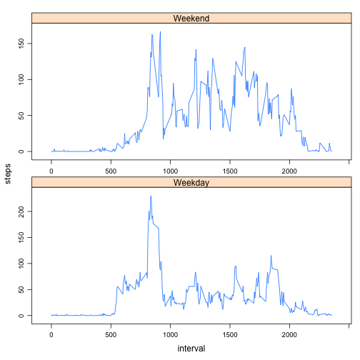

Reproducible Research: Peer Assessment 1
========================================

Loading and preprocessing the data

```r
activity<-read.csv("activity.csv",stringsAsFactor=FALSE)
```

What is mean total number of number of steps taken per day?
==========================================================
Here is the histogram of the total number of steps taken each day

```r
select<-!is.na(activity$steps)
activity1<-activity[select,]
activity4<-summarise_each(group_by(activity1,date),funs(sum))
plot(activity4$steps,type="h",axes=FALSE,ylab="Total Steps",xlab="Date")
axis(1,at=1:53,labels=activity4$date)
axis(2)
box()
```

 

the mean total number of steps taken per day is

```r
mean(activity4$steps)
```

```
## [1] 10766.19
```

the median total number of steps taken per day is

```r
median(activity4$steps)
```

```
## [1] 10765
```

What is the average daily activity pattern
=========================================
Here is the time series plot (i.e. type = "l") of the 5-minute interval (x-axis) and the average number of steps taken, averaged across all days (y-axis)

```r
activity5<-summarise_each(group_by(activity1,interval),funs(mean))
plot(activity5$interval,activity5$steps,type="l",xlab="interval",ylab="average steps")
```

 

The 5-minute interval, on average across all the days in the dataset, which contains the maximum number of steps is

```r
activity5[which(activity5$step== max(activity5$step)),1]
```

```
## Source: local data frame [1 x 1]
## 
##   interval
## 1      835
```


Imputing missing values
=======================
Total number of missing values in the dataset is

```r
nrow(activity)-nrow(activity1)
```

```
## [1] 2304
```

Devise a strategy for filling in all of the missing values in the dataset.
My strategy is fill in all of the missing values with the mean for that 5-minute interval.

Here is the new dataset that is equal to the original dataset but with the missing data filled in.


```r
activityCopy<-activity
for(i in 1:17568)
{
        if(is.na(activity[i,1]))
        {
                if(i%%288==0)
                {
                activityCopy[i,1]<-activity5[288,2]
                }else{
                activityCopy[i,1]<-activity5[i%%288,2]       
                }
        }
        
}
```

Do these values differ from the estimates from the first part of the assignment? What is the impact of imputing missing data on the estimates of the total daily number of steps?

After filling in the missing values.
Here is the  histogram of the total number of steps taken each day.

```r
activity2<-summarise_each(group_by(activityCopy,date),funs(sum))
plot(activity2$steps,type="h",axes=FALSE,ylab="Total Steps",xlab="Date")
axis(1,at=1:61,labels=activity2$date)
axis(2)
box()
```

 

The mean total number of steps is

```r
mean(activity2$steps)
```

```
## [1] 10766.19
```

The median total number of steps is

```r
median(activity2$steps)
```

```
## [1] 10766.19
```

Total number of steps taken each day is larger than before.
The mean total number has no change
The median total number is a little larger than before


Are there differences in activity patterns between weekdays and weekends?
========================================================================

Create a new factor variable in the dataset with two levels – “weekday” and “weekend” indicating whether a given date is a weekday or weekend day.

```r
newFactor<-weekdays(as.Date(activity$date))=="星期六"|weekdays(as.Date(activity$date))=="星期日"

for(i in 1:17568)
 {
         if(newFactor[i])
         {
                newFactor[i]="Weekend"       
         }else{
                 newFactor[i]="Weekday"       
         }
         
 }
 activity3<-cbind(activityCopy,newFactor)
```


```r
activity6<-summarise_each(group_by(activity3,interval,newFactor),funs(mean))
library(lattice)
xyplot(steps~interval| newFactor,
        data = activity6, scales = "free", layout = c(1, 2),
        auto.key = list(x = .6, y = .7, corner = c(0, 0)),type="l")
```

 

From the plot above, we can say that the average steps in weekend is more than weekday
